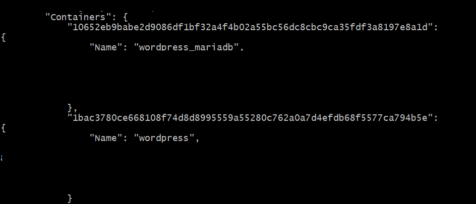
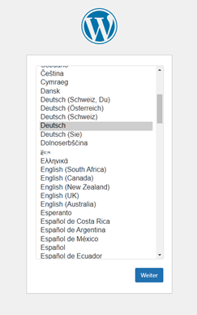
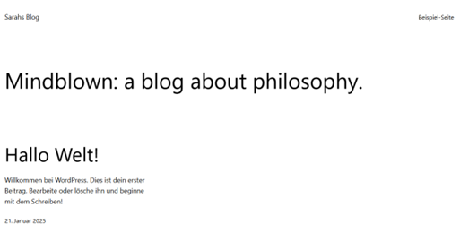
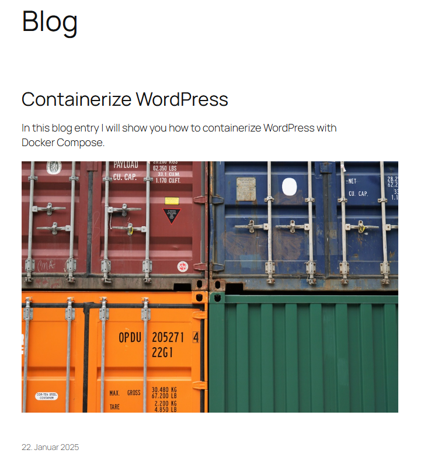

# WordPress Containerization

This repository serves as a guide for containerizing **WordPress** using **Docker Compose**.  
  
This Repository was created as part of my training at the **Developer Academy**.  

## Table of Contents

1. [Technologies](#technologies)  
1. [Description](#description)
1. [Quickstart](#quickstart)  
1. [Usage](#usage)  

## Technologies

* **Docker** 24.0.7
  * **Compose** v2.32.4 (module to install, [More Information](https://docs.docker.com/compose/))

## Description

### WordPress

[WordPress](https://wordpress.com/de/) is a content management system (CMS) that allows users to easily create, manage and publish websites and blogs - without extensive programming knowledge. It is one of the most popular CMS worldwide and powers over 40% of all websites on the Internet (as of 2023).

### Containerize WordPress

Docker offers a possible [compose.yaml](https://hub.docker.com/_/wordpress) file for the WordPress containerization. It shows that **two containers are needed**: one for the WordPress application and one for the database.  

* The compose file uses the `wordpress base-image` which is provided by the official WordPress community and already contains all the essential components to run the WordPress application:
  * slim operating system
  * Apache (web server)
  * PHP (including necessary extensions for WordPress)
  * WordPress files

* For the database-container a MySQL or **MariaDB** database is recommended. In this repository the latter is used here - the open source focused and independent alternative to MySQL. Provided and maintained by the MariaDB community there is a pre-build base-image. It contains, in addition to the necessary operating system:
  * MariaDB server
  * Basic configurations required for operation

## Quickstart

This section provides a fast and **minimal setup guide** for using the tools in this repository. For a more **in-depth understanding** and additional options, please refer to the [Usage](#usage) section.

0) [Fork](https://docs.github.com/de/pull-requests/collaborating-with-pull-requests/working-with-forks/fork-a-repo) the project to your namespace, if you want to make changes or open a [Pull Request](https://docs.github.com/de/pull-requests/collaborating-with-pull-requests/proposing-changes-to-your-work-with-pull-requests/about-pull-requests).

1. [Clone](https://docs.github.com/en/repositories/creating-and-managing-repositories/cloning-a-repository) the project to your platform if you just want to use it:
    * <ins>Example</ins>: Clone the repo e.g. using an SSH-Key:
  
    ```bash
    git clone git@github.com:SarahZimmermann-Schmutzler/wordpress.git
    ```

1. Create an **.enf file** in the project directory. The required variables are provided in [example.env](./example.env).

1. **Build and start the container** in the background (detached mode):

    ```bash
    docker compose up --build -d
    ```

1. Check whether the **server is running** correctly:

* WordPress can be reached under the *IP address of your cloud VM on port 8080*:
  * http://IP_Address_VM:8080

* When you open the page you will be redirected to the **installation page** and can now start creating your account. After the setting, a sample blog page appears if you have not yet written your own post.

## Usage

### Installation and Preparation

1. [Clone](https://docs.github.com/en/repositories/creating-and-managing-repositories/cloning-a-repository) the project to your platform if you just want to use it:
    * <ins>Example</ins>: Clone the repo e.g. using an SSH-Key:
  
    ```bash
    git clone git@github.com:SarahZimmermann-Schmutzler/wordpress.git
    ```

1. Create an **.enf file** in the project directory. The required variables are provided in [example.env](./example.env)</a>.  

    ```bash
    DB_USER=
    DB_NAME=
    DB_PASSWORD=
    MYSQL_ROOT_PASSWORD=
    ```

### Containerization with Docker Compose

1. The [`compose.yaml`](./compose.yaml) is responsible for managing and orchestrating the WordPress and the Database container. It defines what configurations they should have.

1. **Build and start the container** in the background (detached mode):

    ```bash
    docker compose up --build -d
    ```

    * To view the **log files**:

        ```bash
        docker compose logs -f
        ```

    * To **stop** the container:

        ```bash
        docker compose stop <container-name>
        ```

    * To **delete** the container:

        ```bash
        docker compose down <container-name>
        ```

    * To **list all containers** that are operatet by Docker Compose:

        ```bash
        docker compose ps
        ```

    * If no network is defined in the compose file, docker automatically creates one. To check which **networks** exist:

        ```bash
        docker network ls
        ```

        * To list **which containers are on a network**:

            ```bash
            docker network inspect <network-name>
            ```

            * <ins>To check if the wordpress and mariadb container are in the same network</ins>:

                ```bash
                docker network inspect wordpress_default
                ```  

                

1. Check whether the **server is running** correctly:

* WordPress can be reached under the *IP address of your cloud VM on port 8080*:
  * http://IP_Address_VM:8080

* When you open the page you will be redirected to the **installation page** and can now start creating your account:  

    

* After the setting, a sample blog page appears:  

    

* Unless you have already written your first entry and chose a layout:  

    
